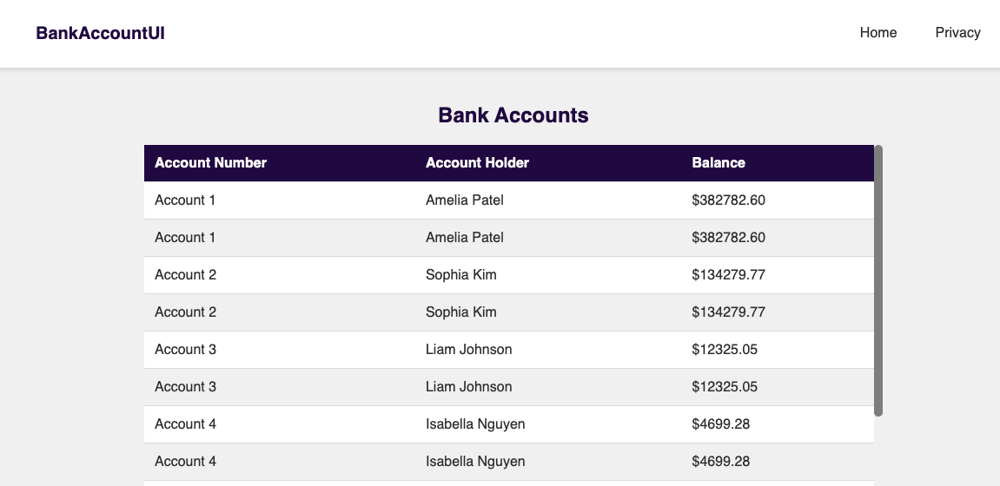

# Bank Account Solution

This solution contains a simple Bank Account web application with a REST API, a front-end built with Thymeleaf, and accompanying tests.

## Project Overview

### Bank Account API
- **Controllers**: Contains the `BankAccountController` which handles HTTP requests related to bank accounts.
- **Models**: Defines the `BankAccount` class representing a bank account with properties like `Id`, `AccountNumber`, `AccountHolderName`, and `Balance`.
- **Services**: Implements the `BankAccountService` class that provides business logic for managing bank accounts.

### Bank Account API Tests
- **Controllers**: Contains unit tests for the `BankAccountController` to ensure correct handling of HTTP requests.
- **Services**: Contains unit tests for the `BankAccountService` to verify business logic and data manipulation.
- **End-to-End Tests**: Contains end-to-end tests to verify the complete workflow of the back-end application.

### Bank Account UI (Front-End)
- **Thymeleaf Templates**: Implements a simple front-end for viewing bank accounts.
- **Integration**: Fetches data from the BankAccountAPI using REST calls.
- **Routing**: Ensures /bankaccounts displays the list of bank accounts.

### Bank Account UI Tests
- **Selenium Tests**: Uses Selenium and ChromeDriver to verify UI functionality.

## Setup Instructions

1. Clone the repository:
   ```sh
   git clone <repository-url>
   ```

### Running the API

1. Navigate to the API project directory:
   ```sh
   cd bank-account-api
   ```

2. Build the project:
   ```sh
   ./gradlew build
   ```

3. Run the API:
   ```sh
   ./gradlew bootRun
   ```

4. Open the browser and navigate to:
   ```
   http://localhost:9090/api/BankAccount
   ```
   This will display the list of bank accounts.

5. Run the API tests:
   ```sh
   ./gradlew test
   ```

### Running the UI
Ensure the API is running.

1. Open a new terminal and navigate to the UI project directory:
   ```sh
   cd bank-account-ui

2. Build the UI project:
   ```sh
   ./gradlew build
   ```

3. Run the UI:
   ```sh
   ./gradlew bootRun
   ```

4. Open the browser and navigate to:
   ```
   http://localhost:8080/bankaccounts
   ```
   This will display the Bank Account UI.
   

5. Run the UI tests (ensure both API and UI are running):
   ```sh
   ./gradlew test
   ```

## Tests

To run all the tests in this project, follow these steps:

1. Ensure you have the necessary dependencies installed and both API and UI projects are running.
2. Open a terminal and navigate to the root directory.
3. Run the following command to execute all tests (API + UI):

   ```sh
   ./gradlew test
   ```
## Context 7 Command
code --add-mcp '{"name":"context7","type":"stdio","command":"npx","args":["@upstash/context7-mcp@1.0.31"],"env":{"CONTEXT7_API_KEY":"${input:CONTEXT7_API_KEY}"},"gallery":"https://api.mcp.github.com","version":"1.0.31"}' --folder-uri .

## Dependencies

This project requires the following dependencies for testing:

- `JUnit 5`: A popular testing framework for Java.
- `Mockito`: A library for creating mock objects in unit tests.
- `RestAssured`: A library for testing REST APIs.
- `Selenium`: A browser automation framework for UI testing.

## Technologies Used
- Java 21
- Spring Boot
- JUnit 5 (for testing)
- Mockito (for mocking dependencies in tests)
- RestAssured (for API testing)
- Selenium WebDriver (for UI testing)

## Contributing
Feel free to submit issues or pull requests for improvements or bug fixes.
